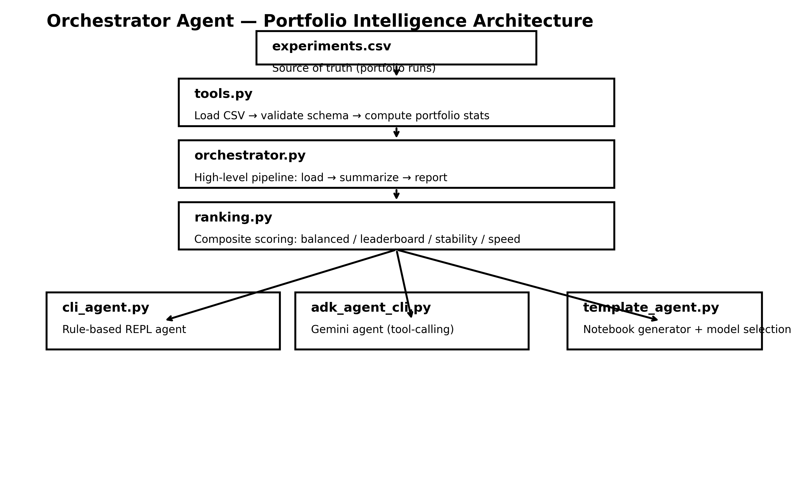

# 🤖 Orchestrator Agent — Autonomous Kaggle Experiment Intelligence Layer

A production-minded experiment intelligence system that transforms raw Kaggle experiment logs into structured insights, strategy-aware rankings, and agent-assisted decision making.

This is not just experiment tracking.  
It is an **intelligent orchestration layer** designed to simulate how high-performing Kaggle practitioners reason about trade-offs between performance, stability, and iteration speed.

It bridges:

- Structured ML experiment logging  
- Portfolio-level statistical analysis  
- Multi-objective ranking strategies  
- Rule-based agent systems  
- LLM-powered tool-calling agents  
- Notebook auto-generation  
- Goal-driven model selection  

This repository demonstrates **system-level ML thinking** beyond notebooks and ad-hoc experimentation.

---

## 🔖 Badges

<p align="center">
  
  
  
  
  
</p>

---

# 🏗 System Architecture

Below is the logical architecture of the Orchestrator Agent layer.

---

## 🏗 Architecture Diagram



---


# 🌟 Core Capabilities

✔ Portfolio-level experiment intelligence  
✔ Multi-objective ranking (balanced / leaderboard / stability / speed)  
✔ CV vs Holdout overfitting diagnostics  
✔ Model-family aggregate analytics  
✔ Training-time trade-off modeling  
✔ Rule-based CLI assistant  
✔ Gemini-powered tool-calling agent  
✔ Kaggle notebook auto-generation  
✔ Goal-aware model-family selection  

---

# 📦 Project Structure

```text
orchestrator_agent/
│
├── tools.py               # CSV loading & portfolio statistics
├── ranking.py             # Multi-strategy ranking engine
├── orchestrator.py        # High-level portfolio analysis
├── cli_agent.py           # Rule-based CLI agent
├── adk_tools.py           # Tool wrappers for LLM function calling
├── adk_agent_cli.py       # Gemini-powered interactive agent
├── template_agent.py      # Notebook generator + model selection
├── notebook_agent.py      # LLM Q&A wrapper
├── viz.py                 # Matplotlib visualizations
├── main.py                # Basic CLI entry point
├── generate_dummy_experiments.py
└── __init__.py
```

---

# 🧠 Ranking Strategies

Experiments are scored via normalized composite scoring:

```
rank_score = w_cv * normalized_cv
           - w_gap * normalized_gap
           - w_time * normalized_time
```

Where:

- CV → performance objective  
- Gap → generalization penalty  
- Time → iteration cost  

Supported strategies:

| Strategy     | Objective Focus |
|--------------|-----------------|
| balanced     | Strong overall trade-off |
| leaderboard  | Maximize CV score |
| stability    | Minimize overfitting |
| speed        | Optimize iteration velocity |

This mirrors real-world ML trade-off reasoning.

---

# 🚀 Quick Start

### Install dependencies

```
pip install pandas numpy matplotlib nbformat google-genai
```

### Generate sample portfolio

```
python generate_dummy_experiments.py
```

### Run portfolio analysis

```
python -m orchestrator_agent.main
```

### Run rule-based agent

```
python -m orchestrator_agent.cli_agent
```

### Run Gemini-powered agent

```
export GOOGLE_API_KEY=your_key
python -m orchestrator_agent.adk_agent_cli
```

---

# 🎯 Strategic Workflow

1. Log experiments to CSV  
2. Run portfolio intelligence  
3. Diagnose overfitting & model-family stats  
4. Rank experiments using strategy  
5. Query agent for trade-off analysis  
6. Generate next experiment plan  
7. Iterate  

This introduces system-level experimentation discipline.

---

# ⚠ Constraints

- Requires structured `experiments.csv`
- Assumes higher metric is better
- LLM features require Google GenAI API key
- Designed for tabular ML portfolios
- Does not auto-submit to Kaggle

---

# 🔮 Roadmap

- Multi-objective optimization engine  
- Optuna / hyperparameter sweeps  
- MLflow integration  
- Kaggle API submission automation  
- Drift monitoring  
- Local LLM backend support  
- Autonomous experiment planner  

---

# 👤 Author

**Chirag Desai**   
Focused on reproducible ML systems, experiment intelligence, and agent-driven workflows.

---

### ⭐ If you find this project useful, consider starring the repository.
